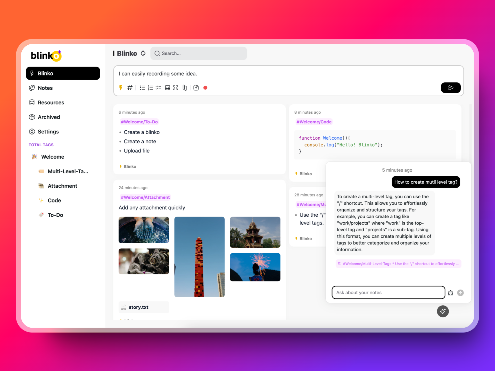

# Blinko - Open Source, Self-hosted

<a href="[https://demo.usememos.com/](https://blinko-five.vercel.app/)">Live Demo</a>
> username:blinko
> password:blinko

Blinko is an innovative open-source project designed for individuals who want to quickly capture and organize their fleeting thoughts. Inspired by the idea of "lightning notes," Blinko allows users to seamlessly jot down ideas the moment they strike, ensuring that no spark of creativity is lost.

What sets Blinko apart is its AI-powered capabilities, offering intelligent suggestions and context-aware enhancements to make your notes more insightful and actionable. Built with a focus on privacy and control, Blinko is fully self-hosted, meaning you can run it on your own server or infrastructure, ensuring your data stays secure and under your ownership.




## Main Features
- **AI-Enhanced Note Retrieval** 🤖：With Blinko's advanced AI-powered RAG (Retrieval-Augmented Generation), you can quickly search and access your notes using natural language queries, making it effortless to find exactly what you need.

- **Data Ownership** 🔒:Your privacy matters. All your notes and data are stored securely in your self-hosted environment, ensuring complete control over your information.

- **Efficient and Fast** 🚀:Capture ideas instantly and store them as plain text for easy access, with full Markdown support for quick formatting and seamless sharing.

- **Lightweight Architecture with Heavy Lifting** 💡:Built on Next.js, Blinko offers a sleek, lightweight architecture that delivers robust performance without sacrificing speed or efficiency.

- **Highly Configurable** ⚙️:Personalize Blinko to match your workflow. Customize everything from server name and description to the UI style and execution scripts, making the platform truly your own.

- **Open for Collaboration** 🔓:As an open-source project, Blinko invites contributions from the community. All code is transparent and available on GitHub, fostering a spirit of collaboration and constant improvement.

- **Completely Free** 🎉:Blinko is and always will be free to use, with no hidden costs or premium features locked behind paywalls.

## Deploy with Docker in seconds

```bash
docker-compose -f docker-compose.prod.yml up -d
```

## Contribution
Contributions are the heart of what makes the open-source community so dynamic, creative, and full of learning opportunities. Your involvement helps drive innovation and growth. We deeply value any contribution you make, and we're excited to have you as part of our community. Thank you for your support! 🙌

## Sponsorship
If you find Blinko valuable, consider supporting us! Your contribution will enable us to continue enhancing and maintaining the project for everyone. Thank you for helping us grow!

## Star history

