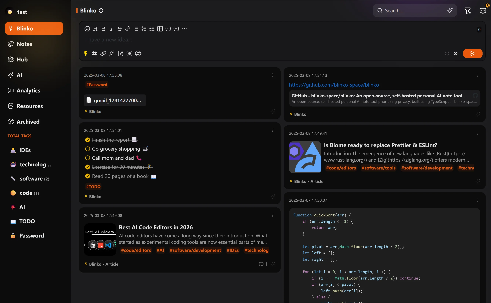

# Blinko - 开源、自托管的笔记应用

<div align="center">


[](https://github.com/denser-org/denser-retriever/pulls?utf8=%E2%9C%93&q=is%3Apr%20author%3Aapp%2Fdependabot)


</div>

<div align="center">

[在线演示](https://demo.blinko.space) •
[文档](https://docs.blinko.space/introduction) •
[中文 Telegram](https://t.me/blinkoChinese) •
[英文 Telegram](https://t.me/blinkoEnglish)
</div>

> 在线演示账号: username:blinko password:blinko

[](https://www.pikapods.com/pods?run=blinko)

Blinko 是一个创新的开源项目，专为那些想要快速捕捉和组织灵感的人设计。它允许用户在灵感闪现的瞬间无缝记录想法，确保不错过任何创意火花。



## 🚀主要特性
- 🤖**AI 增强笔记检索**：通过 Blinko 的先进 AI 驱动的 RAG（检索增强生成）技术，你可以使用自然语言查询快速搜索和访问笔记，轻松找到所需内容。支持 OpenAI、Azure OpenAI 和 Ollama。

- 🔒**数据所有权**：你的隐私至关重要。所有笔记和数据都安全存储在你的自托管环境中，确保对信息的完全控制。

- 🚀**高效快速**：即时捕捉想法并以纯文本形式存储以便于访问，完全支持 Markdown 格式，便于快速排版和分享。

- 💡**轻量架构，强大功能**：基于 Next.js 构建，Blinko 提供了一个轻量级的架构，在不牺牲速度和效率的同时提供强大的性能。

- 🔓**开放协作**：作为开源项目，Blinko 欢迎社区贡献。所有代码都在 GitHub 上公开透明，培养协作和持续改进的精神。

## 🤖 AI 模型支持
### OpenAI
- 支持 OpenAI API
- 支持自定义 API 地址
- 支持 Azure OpenAI

### Ollama
- 支持本地部署
- 默认地址：http://127.0.0.1:11434
- 支持所有 Ollama 模型
- 完全免费，无需 API Key

## 📦快速开始（Docker Compose）

```bash
curl -s https://raw.githubusercontent.com/blinko-space/blinko/main/install.sh | bash
```

## 👨🏼‍💻贡献
贡献是开源社区充满活力、创造力和学习机会的核心。你的参与有助于推动创新和发展。我们深深感谢任何形式的贡献，并很高兴有你成为我们社区的一部分。感谢你的支持！🙌

## 赞助
如果你觉得 Blinko 有价值，请考虑支持我们！你的贡献将使我们能够继续为所有人改进和维护这个项目。感谢你帮助我们成长，你也可以使用 PikaPods 来支持 Blinko。

[](https://www.pikapods.com/pods?run=blinko)

[https://ko-fi.com/blinkospace](https://ko-fi.com/blinkospace)

[https://afdian.com/a/blinkospace/plan](https://afdian.com/a/blinkospace/plan)

## Star 历史

[](https://star-history.com/#blinko-space/blinko&Date) 